# Agent Config — Reference

> Full process details. See SKILL.md for quick start.

```mermaid
graph TB
    subgraph EXPLORE["1. Explore"]
        A["ls .git/config, AGENTS.md,<br/>CONTEXT.md, docs/agents/,<br/>skills/, .opencode/"]
        B["Detect issue tracker<br/>(GitHub/GitLab/Local)"]
        C["Detect meta-repo mode<br/>(skills/ + .opencode/)"]
    end
    subgraph PRESENT["2. Present + Ask"]
        D["Section A: Issue tracker type"]
        E["Section B: Scratch workspace<br/>(issues/kanban/spec/evals/...)"]
        F["Section C: Triage labels (5 roles)"]
        G["Section D: Domain docs config"]
        H["Section E: Design reference<br/>(conditional on frontend)"]
        I["Section F: Workspace skill symlinks"]
        J["Section G: Meta-repo audit<br/>(if meta-repo mode)"]
    end
    subgraph WRITE["3-5. Write + Symlink"]
        J["docs/agents/issue-tracker.md"]
        K["docs/agents/triage-labels.md"]
        L["docs/agents/domain.md"]
        M["docs/agents/design.md (conditional)"]
        N["Update AGENTS.md<br/>## Agent skills block"]
        O["Symlink skills to .opencode/skills/<br/>add paths to opencode.json"]
    end
    subgraph AUDIT["Meta-Repo Only: Audit"]
        P["Check skill_triggers gaps"]
        Q["Check plugin health (.ts vs .js)"]
        R["Check agent sync"]
        S["Print audit report"]
    end
    EXPLORE --> PRESENT
    PRESENT --> WRITE
    WRITE --> AUDIT
```



## Process

### 1. Explore

Look at current repo. Read whatever exists; don't assume:

- `git remote -v` and `.git/config` — is this a GitHub repo?
- `AGENTS.md` and `CLAUDE.md` — which exists? Has `## Agent skills` section?
- `CONTEXT.md` and `CONTEXT-MAP.md`
- `docs/adr/` and any `src/*/docs/adr/`
- `docs/agents/` — prior output from this skill?
- `.scratch/` — local-markdown issue tracker sign
- `skills/` and `.opencode/` — meta-repo detection triggers

### 2. Present findings and ask

Summarise what's present and missing. Walk user through decisions **one at a time**. Start each with plain-language explainer. Show choices and default.

**Section A — Issue tracker.** GitHub (default if remote is GitHub), GitLab, Local markdown, or Other.

**Section B — Scratch workspace.** Create `.scratch/` with agent workspace directories (issues, kanban, spec, evals, verification, out-of-scope). Default: yes.

**Section C — Triage labels.** Five canonical roles: needs-triage, needs-info, ready-for-agent, ready-for-human, wontfix. User can override strings.

**Section D — Domain docs.** Single-context (one CONTEXT.md) or multi-context (CONTEXT-MAP.md + per-context files).

**Section E — Design reference.** Single-domain or multi-domain. Conditional on frontend detection — ask even if not detected.

**Section F — Workspace skill symlinks.** Symlink global skills into `.opencode/skills/` so `@skill-name` works in workspace chat without skills modal. Default: yes (all buckets). User can pick subset.

If meta-repo mode detected, ask one more section:

**Section F — Meta-repo config.** Skill_triggers, plugin health, agent sync, bucket README links.

### 3. Confirm and edit

Show draft of:
- `## Agent skills` block for AGENTS.md
- Contents of `docs/agents/issue-tracker.md`, `triage-labels.md`, `domain.md`, `design.md`
- `.opencode/skills/` symlink plan (which buckets)

Let them edit before writing.

### 4. Write

**Pick file:** edit `CLAUDE.md` if exists, else `AGENTS.md`. Never create one if other exists.

If `## Agent skills` block exists, update in-place. Don't overwrite surrounding sections.

Write docs files using seed templates.

### 5b. Symlink workspace skills

Create `.opencode/skills/` at project root. Symlink leaf bucket dirs from global skills location:

```bash
mkdir -p .opencode/skills
ln -sf ~/.config/opencode/skills/engineering .opencode/skills/engineering
ln -sf ~/.config/opencode/skills/productivity .opencode/skills/productivity
# ... per selected buckets
```

Update `.opencode/opencode.json` `skills.paths` — add leaf bucket paths:

```json
"skills": {
  "paths": [
    ".opencode/skills",
    ".opencode/skills/engineering/planning",
    ".opencode/skills/engineering/design",
    ".opencode/skills/engineering/quality",
    ".opencode/skills/engineering/workflow",
    ".opencode/skills/productivity",
    ".opencode/skills/misc/frontend",
    ".opencode/skills/misc/backend",
    ".opencode/skills/misc/languages",
    ".opencode/skills/misc/security",
    ".opencode/skills/misc/ml",
    ".opencode/skills/misc/mobile",
    ".opencode/skills/misc/devops",
    ".opencode/skills/misc/data"
  ]
}
```

**Meta-repo mode:** JANGAN overwrite existing user-modified files. Insert only. Report gaps in config audit.

### 6. Done

Tell user setup complete. Mention they can edit `docs/agents/*.md` directly later. Mention `@skill-name` now works in workspace chat.

---

## Standard Mode

Default behavior. Scaffolds:

- `.scratch/` — agent workspace directories:
  - `issues/` — issue tracker (tickets, PRDs)
  - `kanban/` — kanban board (columns, cards)
  - `spec/` — specs (*.md, *.xml, *.html)
  - `evals/` — session evaluation reports
  - `verification/` — verification evidence
  - `out-of-scope/` — boundary decisions
- `docs/agents/issue-tracker.md` — from issue-tracker-{github,gitlab,local}.md template
- `docs/agents/triage-labels.md` — from triage-labels.md template
- `docs/agents/domain.md` — from domain.md template
- `docs/agents/design.md` — from design.md template (conditional on frontend)
- `## Agent skills` block in AGENTS.md
- `.opencode/skills/` — workspace skill symlinks (all leaf buckets)
- `.opencode/opencode.json` — updated `skills.paths` (if file exists)

---

## Meta-Repo Mode

Detected when: repo has **both** top-level `skills/` directory AND `.opencode/` directory.

### Exploration Checklist (additional)

    1. **Plugins** (`ls .opencode/plugins/`):
       - Raw `.ts` without compiled `.js`? → warn: OpenCode only loads `.js`
       - Helpers/tests in root plugins/ (not `internal/`)? → warn: auto-discover will fail
       - Shared helpers in `internal/`? → OK if present

2. **Agent files** (`ls agents/` vs `~/.config/opencode/agents/`):
   - Files match? If diverged, report sync status

3. **opencode.json skill_triggers**:
   - Common expected: diagnose, tdd, verify-evidence, openviking, security-review, humanizer, memory-dreaming
   - Often missing: triage, to-spec, to-tickets, wayfinder, zoom-out, improve-codebase-architecture

4. **docs/agents/ existing**:
   - Files present vs expected. Report discrepancies.
   - invocation.md, writing-docs.md = custom additions → preserve

5. **Issue tracker**:
   - `.scratch/issues/` structure: inbox/inprogress/done
   - `00-index.md` dependency graph
   - Pending inbox items
   - `.scratch/kanban/` — kanban board present?
   - `.scratch/spec/` — specs directory present?

6. **Workspace skill symlinks** (`ls .opencode/skills/`):
   - Symlinks present vs expected? Broken ones?
   - `.opencode/opencode.json` has `skills.paths` pointing to leaf buckets?
7. **Pre-flight tools** (check if possible):
   - chrome-devtools MCP, OpenViking, exa web search

### Write Behavior

- **AGENTS.md**: INSERT `## Agent skills` block after `## OpenCode Compatibility` section. Do NOT overwrite existing sections.
- **docs/agents/**: Only create missing files. Report discrepancy if domain.md contains design content.
- **opencode.json**: Do NOT edit. Report missing skill_triggers only.
- **Workspace symlinks**: Create `.opencode/skills/` symlinks from global. Do NOT overwrite existing files.
- **Agent files**: Do NOT edit. Report sync status.

### Config Audit Output

Print end-of-setup audit:

```
## Setup Complete — Meta-Repo Audit

### Config
- [OK]  agents/ → ~/.config/opencode/agents/ — in sync
- [OK]  opencode.json plugins — N registered
- [WARN] skill_triggers missing: [list]
- [OK]  docs/agents/ — N files present, N missing (created)
- [OK]  0 broken symlinks in ~/.config/opencode/skills/
- [OK]  .opencode/skills/ — N leaf bucket symlinks, 0 broken

### Plugin health
- [OK]  All `.js` plugins compiled
- [OK]  internal/ helpers — not auto-discovered
- [INFO] No raw `.ts` without compiled `.js` in plugins/ root

### Pre-flight
- [OK]  OpenViking — connected
- [UNCHECKED] chrome-devtools, exa
```

### Edge Cases

- **False positive**: repo has `skills/` but not for skill management → confirm with user before meta-repo mode
- **Ambiguous**: repo has `.opencode/` but no `skills/` → standard mode (correct)
- **Existing block**: if `## Agent skills` exists, update in-place; do NOT duplicate

---

## Pre-flight Checks

Add pre-flight sections to `docs/agents/preflight.md` (or AGENTS.md if skipping docs layout).

### Browser-QA re-snapshot

If project uses `reviewer` with chrome-devtools MCP:

```markdown
## Browser-QA re-snapshot

On chrome-devtools click/fill failure, ALWAYS re-snapshot first.
Element uid is stale after page state changes. Do NOT retry cached uid.
```

### exa MCP rate-limiting

If scout uses `exa_web_search_exa`:

```markdown
## exa MCP rate limit

Max 10 calls per session. After limit, fall back to `webfetch`
with cached URL (check OpenViking `viking://cache/web/...`).
```

---

## Seed Templates

### Standard Mode

Section B is a directory scaffold, not a template file. Creates:

```
.scratch/issues/
.scratch/kanban/
.scratch/spec/
.scratch/evals/
.scratch/verification/
.scratch/out-of-scope/
```

Templates:

- `issue-tracker-github.md` — GitHub issue tracker
- `issue-tracker-gitlab.md` — GitLab
- `issue-tracker-local.md` — local markdown
- `triage-labels.md` — label mapping
- `domain.md` — domain doc consumer rules (CONTEXT.md + ADRs)
- `design.md` — design reference seed template (conditional on frontend)

### Meta-Repo Mode

Same templates but with meta-repo adjustments:

- **issue-tracker-local.md** — `.scratch/issues/<NN>-<slug>.md` layout with index and dependency graph
- **triage-labels.md** — canonical 5 roles + done, with mapping column
- **domain.md** — domain language + ADR only (separate from design)
- **design.md** — minimal: principles + anti-patterns + consumer rules. No tokens (meta-repo has no UI project unless specified)
